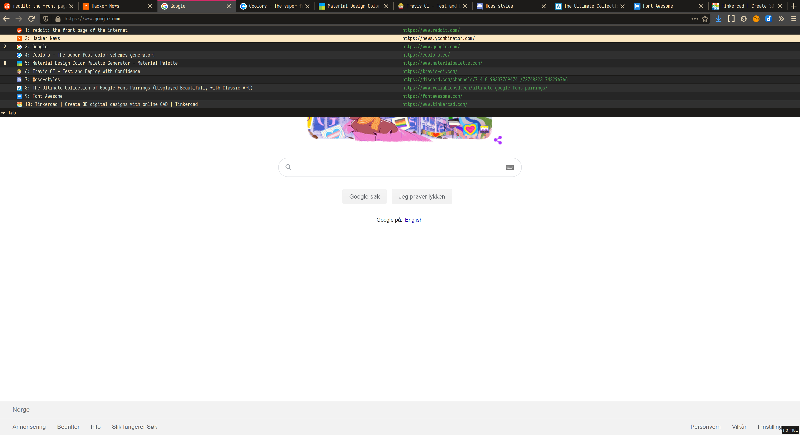
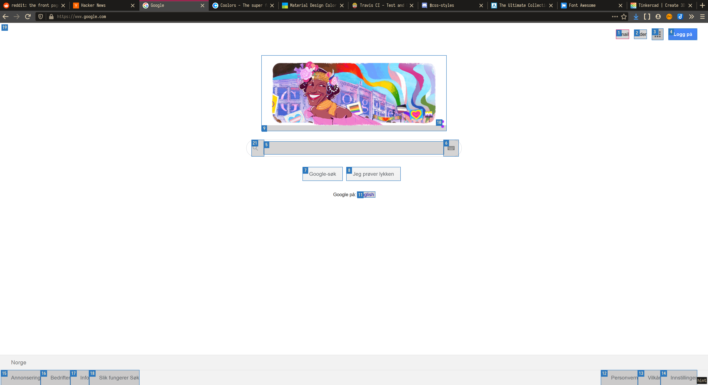

Tridactyl theme
=============




## Installation

You need the native client to install this theme. Run `:installnative`

Put the theme in `~/.config/tridactyl/themes/srcery.css`

Then run `:colors srcery`, to persist the theme put this in your `tridactylrc` file:

```vim
colors srcery
```

See `:help colors` for full documentation.
